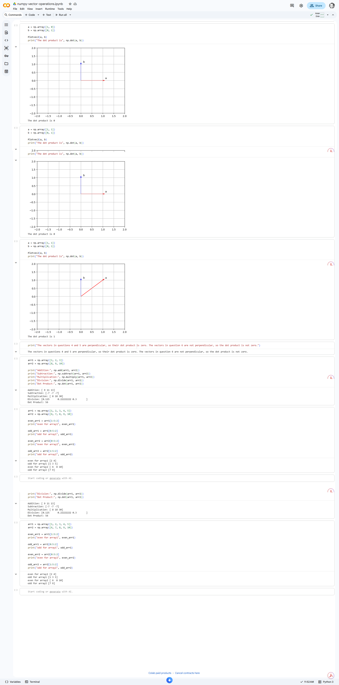

# python-foundations-data-ai
Python fundamentals for data and AI: NumPy vector operations, loops, functions, and file handling with practical exercises and visualizations.
# Python Foundations for Data & AI

This repository showcases my transition into data and AI through hands-on Python exercises.

### NumPy Vector Operations
- Array manipulation and slicing using NumPy
- Vector math including dot product and scalar operations
- Visualization of vectors using matplotlib

### Core Python Exercises
- Conditions and loops
- Functions and logic building
- File handling and text processing

## Why this matters
These exercises build foundational skills for:
- Data analysis
- Machine learning
- AI workflows

---

Currently expanding into data analytics, AI, and Python-based problem solving.
